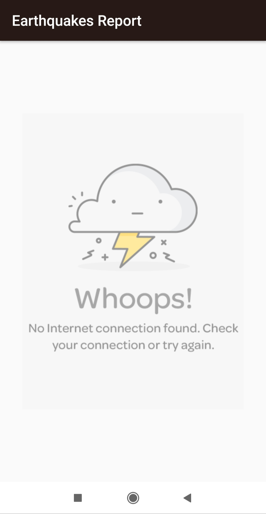
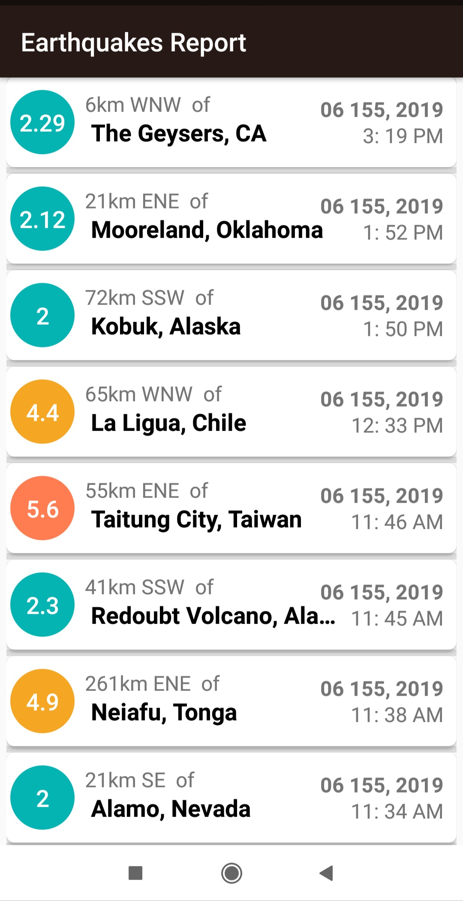
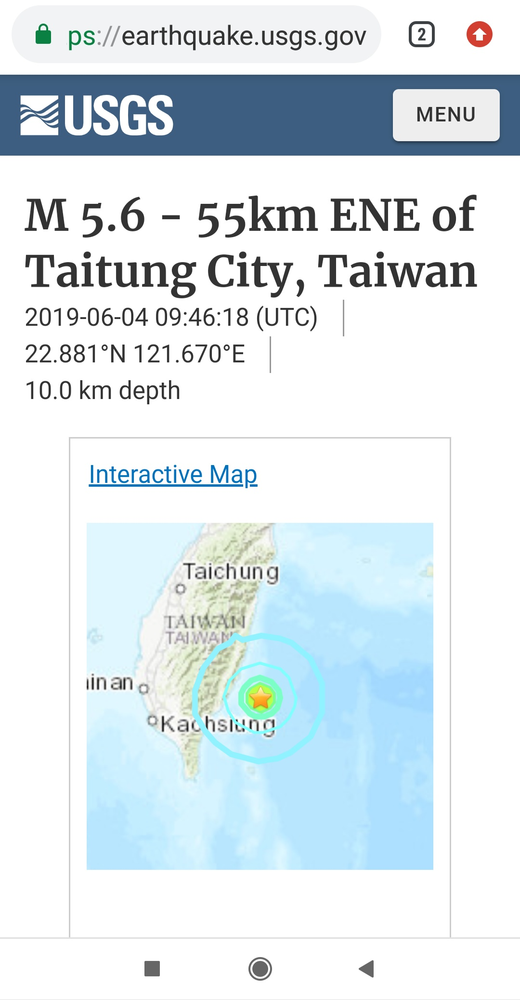

# Eathquack-Report
<ul>
<li>This app displays a list of recent earthquakes in the world</li>
<li>from the U.S. Geological Survey (USGS) organization.</li>
</ul>

Android Goodies
==================
<ul>
<li>HttpURLConnection</li>
<li>AsyncTask</li>
 <li>Using AsyncTasksLoader to connect to the internet</li>
<li>JSON Parsing.</li>
<li>Customizing ListViews,using ArrayLists & ArrayAdapters..</li>
<li>Using progress bar and listview empty for better UX.</li>
</ul>

  
